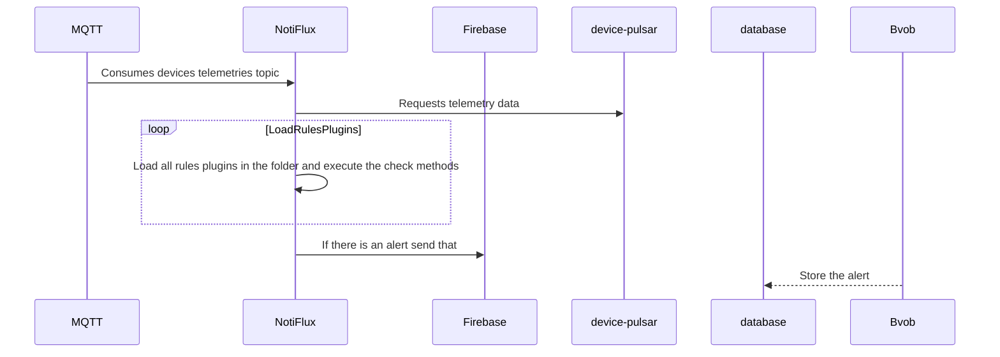

# NotiFlux

Notiflux is a service that consumes devices telemetries coming from mqtt and send notifications according with your rules.

## Data pipeline

```mermaid
sequenceDiagram
    participant MQTT
    participant NotiFlux
    participant Firebase
    participant device-pulsar
    participant database
    MQTT->>NotiFlux: Consumes devices telemetries topic
    NotiFlux->>device-pulsar: Requests telemetry data
    loop LoadRulesPlugins
        NotiFlux->>NotiFlux: Load all rules plugins in the folder and execute the check methods
    end
    NotiFlux->>Firebase: If there is an alert send that
    Bvob-->>database: Store the alert
```