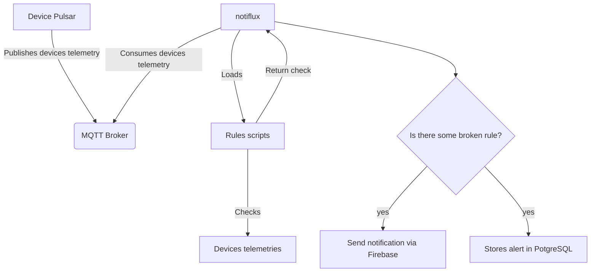

# NotiFlux

Notiflux is a service that consumes devices telemetries coming from mqtt and send notifications according with your rules.

## Data pipeline



## Rule script

This is the minimal example for a rule script

```python
import logging

HANDLED_DEVICE = "UPS"

logger = logging.getLogger("uvicorn")

def evaluate(telemetry: dict):
    logger.info("Running evaluation method for low input voltage")
    return True
```